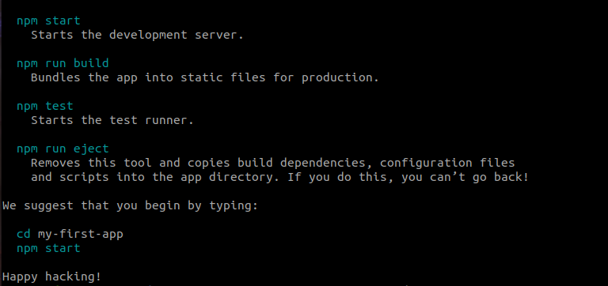
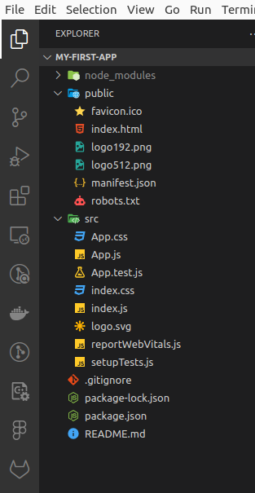
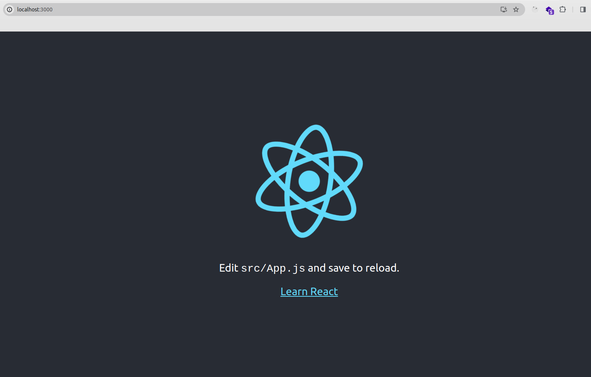
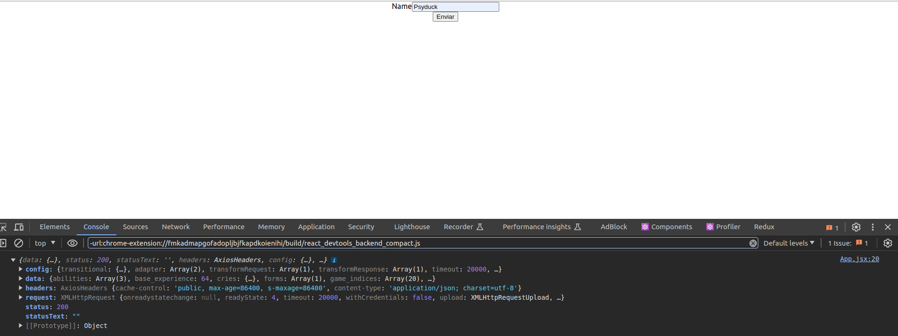
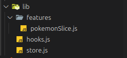
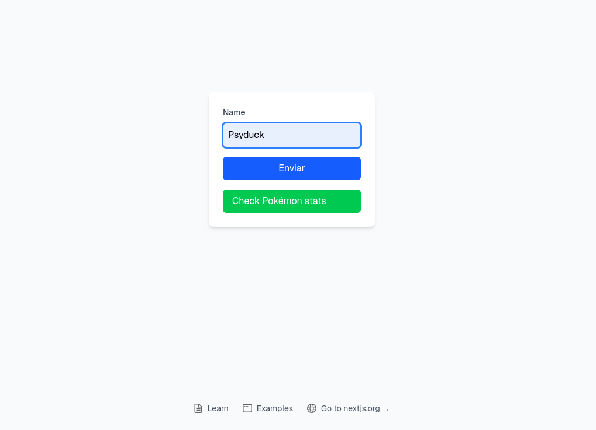
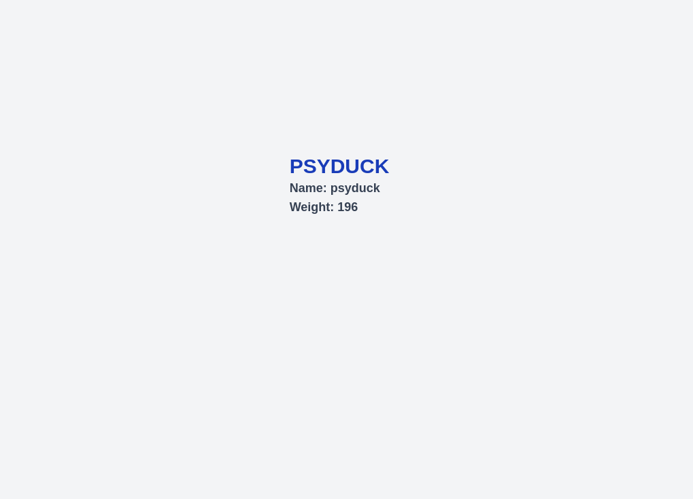

# ReactNoob2Pro
React formation that includes: React basics, scss, axios and lingui

Puede que ahora te entre el miedo porque no sepas que es axios, scss o incluso React. ¡No te preocupes, mostro! Nadie nació sabiendo. Vamos a ver paso a paso cómo crear una aplicación React eficiente. Prepárate para pasar de ser un tolai a un chad.

 

Así que... empecemos por el principio:

## Épica 1: React

### Capítulo 1: ¿Qué es React?

React es una biblioteca de de JavaScript que se utiliza para construit interfaces de usuario. Con React podemos montar una aplicación web con componentes reutilizables. Tener componentes reutiliazzbles nos ayuda a manter un código limpio y entendible. Se pueden crear aplicaciones de React tanto con JavaScript como con TypeScript, pero para la "formación" nos centraremos en la creación de una web app con React basada en JavaScript (JSX).

### Capítulo 2: ¿Cómo se usa React?

Puedes crear una aplicación React con el [framework](https://es.react.dev/learn/start-a-new-react-project) adecuado para tu desarrollo. Para esta pequeña formación no necesitamos liarnos y meternos en frameworks ya que a duras penas sabemos lo que es React. ¡Así que empezamos!

- 1 Abrimos una terminal en la ruta deseada y ejecutamos el siguiente comando:
  ```
    npx create-react-app myFirstApp
  ```
  Con **npx create-react-app** ejectuamos el comando que arrancará la aplicación, que en este caso se llamará **myFirstApp**. Podemos llamar la App como queramos, va a funcionar igual (eso sí, no escribas el nombre ni con espacios ni en camelCase. Utiliza snake_case o kebab-case). Yo utilizo kebab case porque tengo hambre.
  
- 2 Veremos que se ha creado una nueva carpeta llamada **myFirsApp**. Nos movemos a dicha ruta y abrimos nuestro IDE favorito. En mi caso voy a usar vscode así que voy a ejecutar
  `code .`  
  Veremos que se ha generado una app con una estructura de directorios y que ya es funcional.

  

  Voy a explicar brevemente lo que contiene cada carpeta:
    * node_modules: esta carpeta contiene la información que hace posible que nuestra app funcione. Es donde se almacenan todas las bibliotecas y dependencias de terceros que se descargan a través de (Node Package Manager) o yarn, que son gestores de paquetes de JavaScript.
    * public: esta carpeta contiene los archivos que serán servidos públicamente por tu servidor web y que pueden ser accedidos directamente en el navegador. El index.html que contiene es lo que va a cargar la web.
    * src: carpeta src de toda la vida. Ahí dentro vamos a meter nuestro código.

  Vale, ¿pero qué es package.json? Este contiene la información del proyecto, tal cómo scripts o liberías a instalar. Por ejemplo: si clonamos una App React desde github a nuestro pc necesitaremos ejectuar el comando `npm install` o `npm i` para así instalar las librerías necesarias para poder ejectuar el proyecto en nuestra máquina.

- 3 Llegados a este punto abrimos una terminal en nuestro IDE y ejecutamos el comando `npm run start`. Así se arrancará el proyecto. Automáticamente se abrirá el navegador con nuestra App.


- 4 El archivo App.js situado en /src es de donde coge la información el archivo index.html situado en la carpeta /public. Cualquier cambio que hagamos hará una nueva build.

Como hemos podido ver, crear un proyecto en React a palo seco no tiene ningún tipo de misterio. Si quieres, como primera iteración, puedes trastear un poco el proyecto modificando el App.js y el favicon. Pon lo que tú quieras, total, es para aprender y no vas a entregárselo a nadie.

## Épica 2: Scss

Para utilizar scss o sass debemos ejecutar el siguiente comando en la raíz del proyecto o en la ruta en la que esté ubicado el archivo **package.json**.
```
npm install sass
```
Scss es css pero guay. La mayor ventaja que le encuentro yo es que se pueden declarar variables, ahorrándote así el tener que reescribir los mismo estilos una y otra vez. 

``` scss
$font-stack: Helvetica, sans-serif;
$primary-color: #333;

body {
  font: 100% $font-stack;
  color: $primary-color;
}
```
Dichas variables se pueden importar en otros archivos .scss como si de una variable global se tratase.
Archivo **global.scss**:
```scss
$breakpoint-mobile: 768px;
$white: #FFFFFF;
$bg-color-alt: #F5F5F5;

```
Archivo que importa los estilos:
```scss
@use "global-styles.scss" as g;

#dashboard-home {
            display: flex;
            align-items: center;
            color: g.$white; //uso de variable global
            font-weight: 700;
            text-decoration: none;
}

```

 Otro punto a favor es el poder anidar estilos.


```scss
nav {
  ul {
    margin: 0;
    padding: 0;
    list-style: none;
  }

  li { display: inline-block; }

  a {
    display: block;
    padding: 6px 12px;
    text-decoration: none;
  }
}
```

Como puedes ver, no tiene mucho misterio.

## Épica 3: Axios

### Capítulo 1: ¿Qué diantres es esto?


Axios es un cliente HTTP basado en promesas para node y navegador. Por lo tanto también nos sirve en proyectos React, que es para lo que nos interesa. Hablando en plata, con AXIOS gestionaremos las respuestas de nuestros endpoints. 


Para instalarlo en nuestro proyecto ejecutamos el siguiente comando.

```
npm install axios
```

Para entender como utilizar Axios utilizaremos [PokeAPI](https://pokeapi.co/)

### Capítulo 2: Instancia de Axios

Antes de empexar a hacer llamadas al endpoint que queremos debemos realizar una instancia de Axios. Esta instancia nos servirá para todas las llamadas que tengan la misma URL base. Así que empecemos:

- 1 En la ruta /src creamos una carpeta llamada api. Ahí dentro vamos a crear todos los archivos relacionados con llamadas a API.
- 2 Creamos un archivo JSX en el que escribiremos la instancia de Axios. En este caso yo he creado una clase llamada **pokeApi.jsx**. Y dentro he escrito el siguiente código: 

``` javascript
import axios from "axios"

class pokeAPI {
    APIBaseURL = "https://pokeapi.co/api/v2/"; //URL que todas las queries tendrán en común

    instance = axios.create({ //creamos la instancia de axios
        baseURL: `${this.APIBaseURL}`,
        timeout: 20000,
        headers: {
            "Content-Type":"application/json"
        }
    })
}

// no olvidemos exportar la clase. Así podremos llamarla dónde nos haga falta
export default pokeAPI; 

```

### Capítulo 3: Llamadas a API

Ahora que ya tenemos nuestra instancia de Axios creada ya podemos hacer llamadas a los endpoints que necesitemos para nuestro proyecto.

- 1 Creamos una carpeta dentro de /api llamada **requests**. Dentro vamos a crear los archivos que veamos convenientes para realizar nuestras llamadas.
- 2 Creamos un archivo en el qué haremos las llamadas. En mi caso lo he **llamado pokeRequests.jsx**. Dentro de este archivo importamos la clase en la que hemos creado la instancia de Axios.

``` javascript
import pokeAPI from "../pokeAPI";

const APIinstance = new pokeAPI();
```
- 3 Ahora ya podemos atacar a los endpoints que necesitemos para nuestro proyecto. En mi caso yo "ataco" al endpoint que me devuelve pokemons por su nombre.

``` javascript
export const getPokemon = async (name) => { //pasamos el nombre por parámetro
    try {
        const response = await APIinstance.instance.get(
            `${APIinstance.APIBaseURL}pokemon/${name}` //indicamos al endpoint el nombre
        )
        return response;
    } catch (error) {
        console.log(error);
    }
}
```

- 4 El paso final es hacer que el usuario pueda realizar las llamadas mediante una interfaz de usuario. Por lo tanto volvemos al archivo App.js y ahí hacemos la "magia".

  - Primero: importar la función que querramos utilizar. En este caso getPokemon. Los import van al principio del archivo.
  ``` javascript
  import logo from './logo.svg';
  import './App.css';

  import { getPokemon } from './api/requests/pokeRequests';
  ```

  - Segundo: utilizar el hook useState para así obtener el valor del nombre del Pokémon que el usuario desea buscar.

  ``` javascript
  import { useState } from 'react';

  function App() {
    const [name, setName] = useState();
  ```

  - Tercero: creamos un formulario de método get en el que vamos a manejar la solicitud:
  ``` javascript
    return (
    <div className="App">
      <form action="" method="get" onSubmit={handleSubmit}>
        <div>
          <label htmlFor="pokemonName">Name</label>
          <input type="text" className="form-control" id="pokemonName" onChange={handleNameChange} placeholder="Enter Pokémon name" />
        </div>
        <button type="submit">Enviar</button>
      </form>
    </div>
  );
  ```
- Cuarto: ahora tenemos que crear diferentes eventos para hacer funcional este input. Primero creamos la función que va a encargarse de recoger el valor del input:text. 

``` javascript
  function App() {
    const [name, setName] = useState();

    const handleNameChange = (e) => {
      setName(e.target.value.toLowerCase()); //Pasamos el valor a minúscula para que el endpoint no nos devuelva un 404. Solo acepta nombres en minúscula.
  }
```
Ahora llamamos a la función que hemos creado en la carpeta requests.

``` javascript
  const [name, setName] = useState();

  const handleNameChange = (e) => {
    setName(e.target.value);
  }

  const handleSubmit = (e) => {
    e.preventDefault();

  getPokemon(name).then(
    (response) => {
      if (response) {
        console.log(response)
      } else {
        console.log("Error: ", response)
      }
    }
  )
  }
```

En Axios utilizamos el **.then()** para manejar la respuesta que nos devuelva el endpoint.

El código final luce así:
``` javascript
import logo from './logo.svg';
import './App.css';

import { getPokemon } from './api/requests/pokeRequests';
import { useState } from 'react';

function App() {
  const [name, setName] = useState();

  const handleNameChange = (e) => {
    setName(e.target.value.toLowerCase());
  }

  const handleSubmit = (e) => {
    e.preventDefault();

  getPokemon(name).then(
    (response) => {
      if (response) {
        console.log(response)
      } else {
        console.log("Error: ", response)
      }
    }
  )
  }

  return (
    <div className="App">
      <form action="" method="get" onSubmit={handleSubmit}>
        <div>
          <label htmlFor="pokemonName">Name</label>
          <input type="text" className="form-control" id="pokemonName" onChange={handleNameChange} placeholder="Enter Pokémon name" />
        </div>
        <button type="submit">Enviar</button>
      </form>
    </div>
  );
}

export default App;
```

Ahora cuando hagamos una llamada recibiremos una respuesta que veremos por consola




## Épica 4: Redux

Vale, en estos meses que no he estado actualizando este repo han pasado cosas. React ha decidido deprecar create-react-app (xD). Así que he decidido rehacer la app con Next.js. Así que bueno, haz click [aquí](https://github.com/lapini99/react-formation) para ir al proyecto en Next.

Ahora sí que sí, vamos con [Redux](https://redux.js.org/usage/nextjs).

### Capítulo 1: ¿Qué es Redux?


Aparte de ser tremendo videojuego Redux es una biblioteca JavaScript opensource que nos permite manejar estados de en nuestra página web de manera global. También existe **ContextAPI** de manera nativa en React. Son más o menos lo mismo, con entender cómo funciona uno también entiendes el otro.

Para instalar Redux en nuestro proyecto ejecutamos el siguiente comando:

```
npm i react-redux && @reduxjs/toolkit
```

### Capítulo 2: Cómo utilizar Redux

Antes de nada vamos a organizarnos. En nuestra carpeta src creamos una carpeta lib en la que vamos a ir añadiendo nuestros archivos Redux. Debería quedar algo tal que así:


En el archivo **store.js** creamos una función para generar un store por cada solicitud. Es un pelín diferente a como lo haríamos con React clásico.

```javascript
import { configureStore } from '@reduxjs/toolkit'
import pokemonReducer from './features/pokemonSlice';

export const makeStore = () => {
  return configureStore({
    reducer: {
        pokemon: pokemonReducer,
    }
  })
}
```

En el archivo **hooks.js** escribimos este código para simplificar el uso de hooks de Redux. Así nos ahorramos problemas con los tipados. El ejemplo de este desarrollo es con JavaScript pero como el conocimiento no ocupa lugar lo añado.

```javascript
import { useDispatch, useSelector, useStore } from 'react-redux'

// Use throughout your app instead of plain `useDispatch` and `useSelector`
// Esto es conveniente si usamos typeScript
export const useAppDispatch = useDispatch.withTypes()
export const useAppSelector = useSelector.withTypes()
export const useAppStore = useStore.withTypes()
```

Ahora que tenemos el store debemos proveerlo a la aplicación. Para logarlo debemos escribir el siguiente código en storeProvider.jsx. Archivo qu crearemos en la ruta /app.

```javascript
'use client' //añadimos use client ya que ejecutamos acciones en el lado del cliente
import { useRef } from 'react'
import { Provider } from 'react-redux'
import { makeStore } from '../lib/store'

export default function StoreProvider({ children }) {
  const storeRef = useRef(null)
  if (!storeRef.current) {
    // Creamos la instancia de la tienda la primera vez que se renderiza
    storeRef.current = makeStore()
  }

  // Wrappearemos toda nuestra app dentro de este componente en el layout.js para así poder acceder al estado en cualquier componente
  return <Provider store={storeRef.current}>{children}</Provider>
}
```

Podemos crear una carpeta llamada features en la que podemos ir creando un archivo por cada tipo de store que tengamos. En este caso yo voy a crear el archivo **pokemonSlice.js** y ahí dentro voy a crear el objeto Pokémon que se podrá manejar por la web.

```javascript
import { createSlice } from '@reduxjs/toolkit';

// Estado inicial del objeto Pokémon
const initialState = {
  name: '',
  weight: '',
};

// Manejadores con el que alteraremos el estado del objeto
const pokemonSlice = createSlice({
  name: 'pokemon',
  initialState,
  reducers: {
    setPokemonName(state, action) {
      state.name = action.payload;
    },
    setPokemonWeight(state, action) {
      state.weight = action.payload;
    },
    clearPokemonName(state) {
      state.name = '';
    },
  },
});

// Por cada función que creemos tendremos que añadirla a este exportador
export const { setPokemonName, setPokemonWeight, clearPokemonName } = pokemonSlice.actions;

export default pokemonSlice.reducer;

```

### Capítulo 3: Cómo aplicar Redux

Lo más chungo lo hemos hecho. Ahora aprenderemos a manejar el estado dónde nos plazca. Lo primero que debemos hacer es wrappear toda la App en el contexto de Redux. Para hacer esto debemos ir al layout.js que encontramos en la ruta app.

Primero de todo importamos el Provider (yo lo he importado en la línea 1):

``` javascript
import StoreProvider from './storeProvider'
```

Una vez lo hayamos importado wrappeamos la App tal que así

```javascript
export default function RootLayout({ children }) {
  return (
    <html lang="en">
      <StoreProvider>
        <body
          className={`${geistSans.variable} ${geistMono.variable} antialiased`}
        >
          {children}
        </body>
      </StoreProvider>
    </html>
  );
}
```

Si Next te da problemas de hydration revisa cómo has wrappeado la App. Debes meter todo el body dentro.

Ahora toda tu App sabe que existen los Store.

Para modificar el valor del Pokémon debemos ir al formulario y modificar el handleSubmit que habíamos creado anteriormente.

Primero importamos las acciones que vayamos a ejecutar. En este caso importamos useAppDispatch, setPokemonName y setPokemonWeight.

```javascript
import { setPokemonName, setPokemonWeight } from '@/lib/features/pokemonSlice';
import { useAppDispatch } from "@/lib/hooks";

```
Y luego modificamos el código.

```javascript

const dispatch = useAppDispatch(); //instanciamos el manejador

const handleSubmit = (e) => {
    e.preventDefault();

    getPokemon(name).then(
      (response) => {
        if (response) {
          dispatch(setPokemonName(response.data.name));
          dispatch(setPokemonWeight(response.data.weight));
          console.log(response)
        } else {
          console.log("Error: ", response)
        }
      }
    )
  }
```

Ahora el valor de nuestro estado se ha cambiado. Cómo la gracia de todo esto es mantener el valor entre rutas lo que he hecho ha sido crear una nueva ruta para ver los datos que he almacenado.

Creamos una carpeta dentro de app llamada **selected-pokemon** y dentro creamos un archivo page.js.

Y en dicho archivo escribimos el siguiente código:

```javascript
"use client";
import { useAppSelector } from '@/lib/hooks';
import React from 'react'

export default function SelectedPokemon() {
    //Seleccionamos que estado queremos y lo almacenamos en una variable. Así es más sencillo acceder a sus campos
    const pokemon = useAppSelector((state) => state.pokemon);
    console.log(pokemon);
    return (
        <div className="flex items-center justify-center h-screen bg-gray-100 text-xl font-bold text-blue-600">
            {pokemon ? (
                <div>
                    <h1 className="text-3xl text-blue-800 uppercase">{pokemon.name}</h1>
                    <p className="text-lg text-gray-700">Name: {pokemon.name}</p>
                    <p className="text-lg text-gray-700">Weight: {pokemon.weight}</p>
                </div>
            ) : (
                <p>No Pokémon selected</p>
            )}
        </div>
    )
}
```

Para acceder a la nueva ruta he creado un botón en el formulario. Queda así:

```javascript
  <form
          action=""
          method="get"
          onSubmit={handleSubmit}
          className="flex flex-col gap-4 bg-white p-6 rounded-lg shadow-md w-full max-w-md"
        >
          <div className="flex flex-col gap-2">
            <label
              htmlFor="pokemonName"
              className="text-sm font-medium text-gray-700"
            >
              Name
            </label>
            <input
              type="text"
              className="form-control border border-gray-300 rounded-md p-2 focus:outline-none focus:ring-2 focus:ring-blue-500 focus:border-blue-500"
              id="pokemonName"
              onChange={(e) => setName((e.target.value).toLowerCase())}
              placeholder="Enter Pokémon name"
            />
          </div>
          <button
            type="submit"
            className="bg-blue-500 text-white py-2 px-4 rounded-md hover:bg-blue-600 transition duration-200"
          >
            Enviar
          </button>
          <Link
            href="/selected-pokemon"
            className="bg-green-500 text-white py-2 px-4 rounded-md hover:bg-green-600 transition duration-200"
          >
            Check Pokémon stats
          </Link>
  </form>
```
Y la magia ya está lista.




